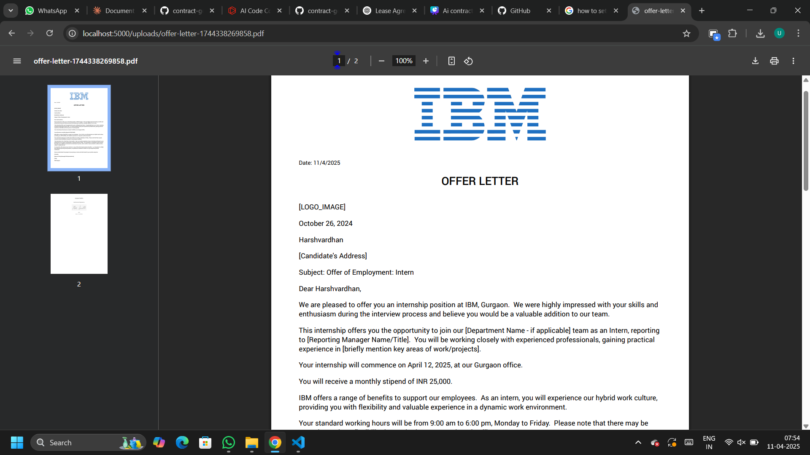
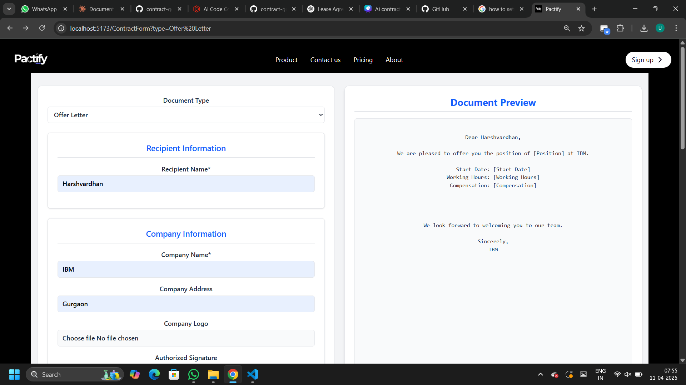

# Pactify - Smart Contract Generation System

Pactify is a web application for generating professional contracts and documents with ease. The system supports multiple contract types including job contracts, freelancer agreements, rental contracts, and offer letters.

## Features

- Generate professional contracts in PDF format
- Multiple contract templates available
- User-friendly form interface
- Client-server architecture
- Built with React (Vite) frontend and Node.js backend

## Available Contract Types

1. Job Contract
2. Freelancer Contract  
3. Rental Contract
4. Offer Letter

## Images

### Home Page


### Products


### Final Output



### Contract Review



## Installation

1. Clone the repository
2. Install dependencies for both client and server:

```bash

# Setting up server
cd server
npm install
node index.js
```

## Running the Application

### Development Mode

Run both client and server in development mode:
Now start a new terminal

```bash
# Setting up client (frontend)
npm install

npm run dev
```

The client will run on `http://localhost:5173` and server on `http://localhost:5000`

### Production Build

```bash
# Build client
npm run build

# Start server
cd server
node index.js
```

## Important Commands

| Command | Description |
|---------|-------------|
| `npm run dev` | Start Vite development server |
| `npm run build` | Create production build |
| `npm run lint` | Run ESLint |
| `npm run preview` | Preview production build locally |
| `cd server && node index.js` | Start backend server |

## Project Structure

```
pactify/
├── public/            # Static assets
├── server/            # Backend server
│   ├── public/        # Server public files
│   ├── uploads/       # Generated contract storage
│   └── index.js       # Server entry point
├── src/               # Frontend source
│   ├── components/    # React components
│   │   ├── ContractForm.jsx  # Main contract form
│   │   ├── JobContract.jsx   # Job contract component
│   │   ├── FreelancerContract.jsx
│   │   ├── RentalContract.jsx
│   │   └── OfferLetter.jsx
│   └── App.jsx        # Main application component
├── vite.config.js     # Vite configuration
└── package.json       # Frontend dependencies
```

## Contributing

Pull requests are welcome. For major changes, please open an issue first to discuss what you would like to change.

## License

This project is open source and available under the MIT License.

## 👨‍💻 Author

**I'm Harshvardhan Follow me on**
💼 GitHub: [@escharsh](https://github.com/escharsh)
📧 LinkedIn: [Harsh Vardhan](https://www.linkedin.com/in/harsh-vardhan-6748a632a/)
